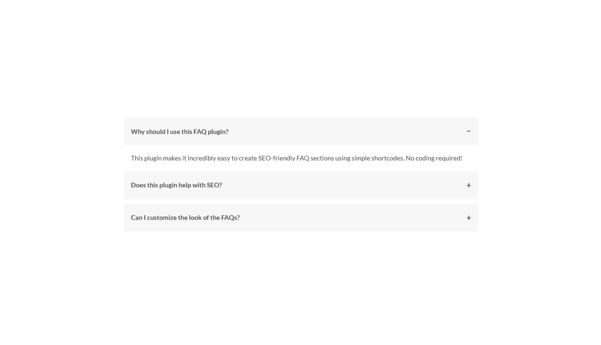
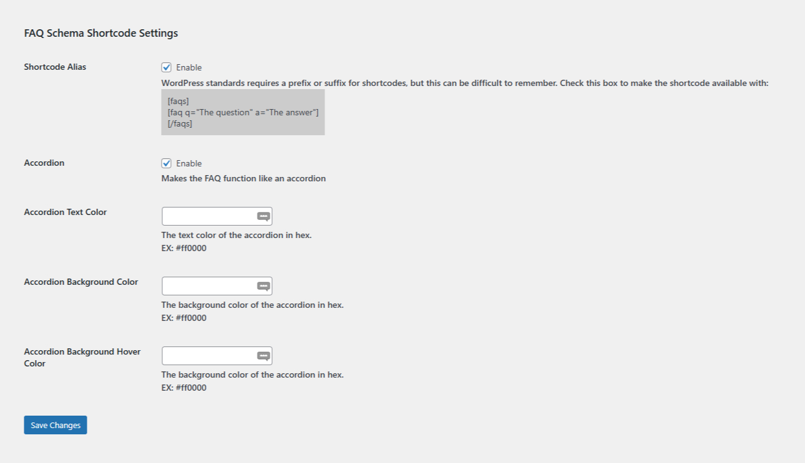

## Description

FAQ Schema Shortcode is a WordPress plugin that allows you to easily add FAQ sections to your site using simple shortcodes. It automatically generates structured data (JSON-LD schema) for each FAQ, helping search engines better understand your content and improving your site's SEO with rich results. By using the `[faqs_dbm]` and `[faq_dbm]` shortcodes, you can quickly create FAQs that are both user-friendly and SEO-friendly, enhancing your site's visibility in search engines.

### Example Usage

```shortcode
[faqs_dbm]
[faq_dbm q="What color is the sky?" a="Blue"]
[faq_dbm q="What color is grass?" a="Green"]
[/faqs_dbm]
```

### Features

- Shortcode alias: Enable `[faqs]` and `[faq]` shortcodes in settings if no conflicting shortcodes exist.

### Roadmap

- Add accordion functionality for FAQ sections.

## Installation

1. Backup your WordPress site.
2. Upload the plugin files to the `/wp-content/plugins/` directory, or install the plugin through the WordPress plugins screen directly.
3. Activate the plugin through the 'Plugins' screen in WordPress.

## Screenshots




## Changelog

### 1.0.1

- Added: Accordion option
- Added: Accordion text color option
- Added: Accordion background color option
- Added: Accordion background hover color option
- Bugfix: Extra line breaks

### 1.0.0

- Initial release.